<h1 style="font-size: 20px">WESTERN FLASH - <i>Board Game Company Logo</i> - 2022</h1>
<h2 style="font-size: 18px">PROJECT OVERVIEW</h2>
The following project is a logo design concept presentation for Western Flash International, a fictional company that manufactures and ships atmospheric board games right to the customer's door. Their target audience is people on a budget. (This project was created from an automatic website-generated logo design inquiry.)
<h2 style="font-size: 18px">THE CHALLENGE</h2>
The inquiry from WFI requested a logo that conveys a sense of delight, while being fresh. They wanted a wordmark that uses the color white, with the intention of using it on their company website.
<h2 style="font-size: 18px">THE PROCESS</h2>
Keeping in mind the client's intended use of the logo, color, target audience, brand name, and business purpose, combined with the mood the client wished to convey, I arrived at these four initial concepts. My process involved building, directly into Adobe Illustrator, several potential typographies to choose from and several symbols that could compliment the wordmark in some way.​​​​​​​
  

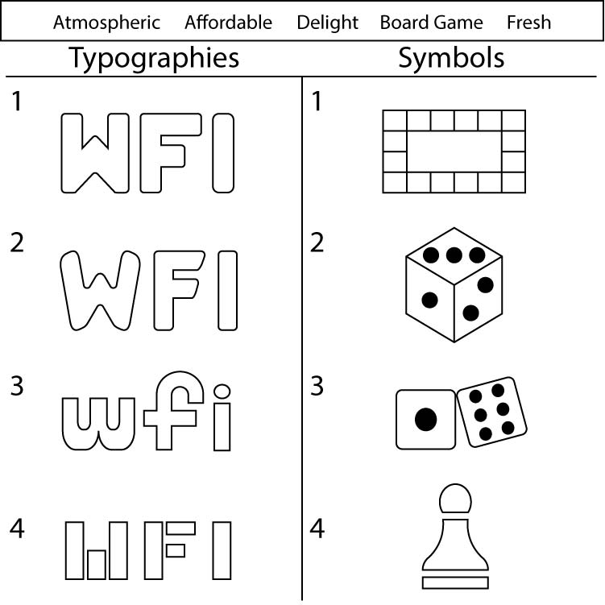

 
Going forward, I then narrowed down the project to two finalized concepts, created several black and white variations, and then generated photo mockups of the concepts in action via PlaceIt.
<h2 style="font-size: 18px">FINALIZED LOGO CONCEPT #1 (4 VARIATIONS)</h2>

    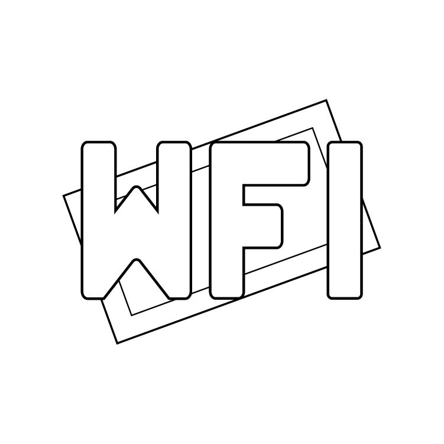
    &nbsp;
    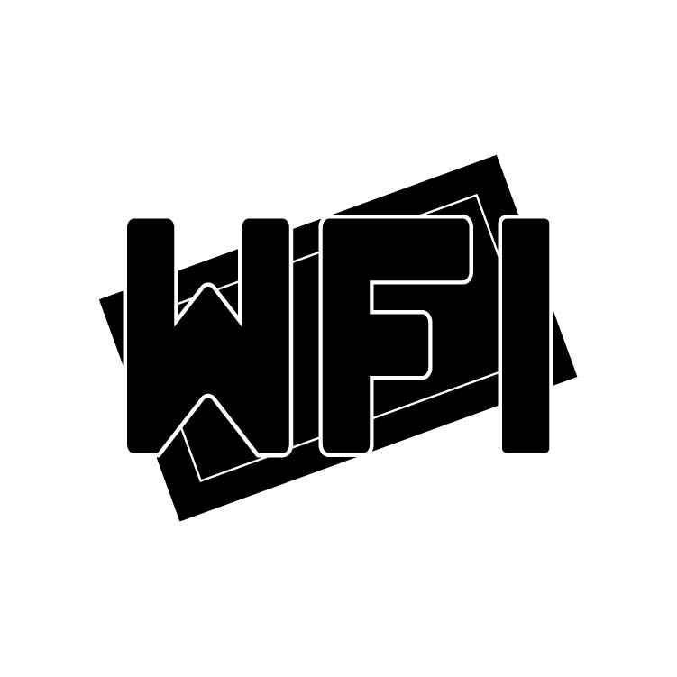
    &nbsp;
    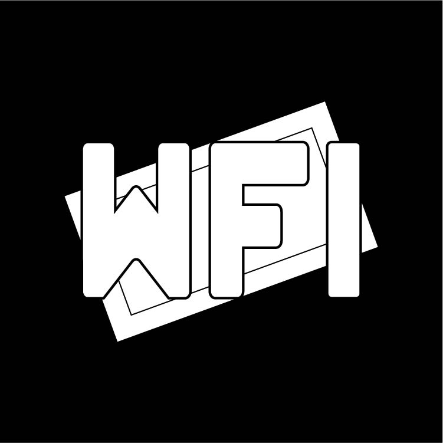
    &nbsp;
    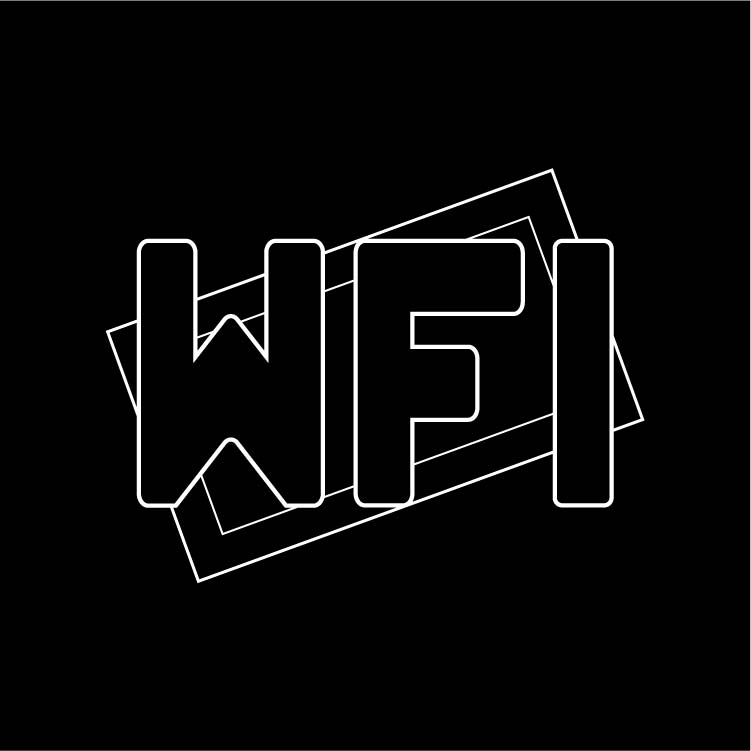

<h3 style="font-size: 16px">Concept #1: Company initials in block letters affixed over a tilted rectangular shape resembling a board</h3>

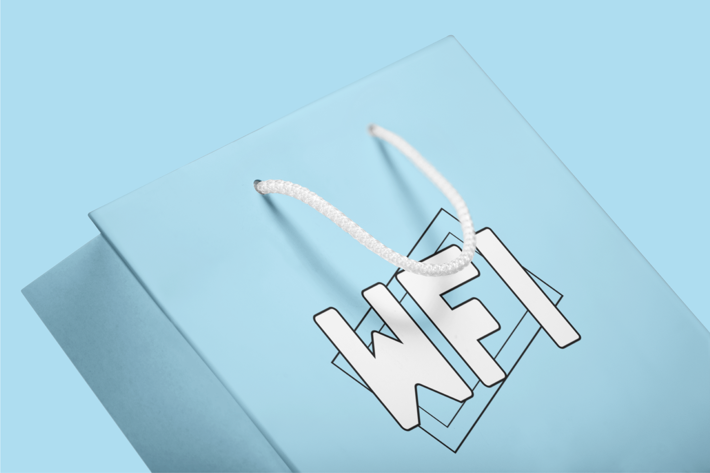

 

 

<h2 style="font-size: 18px">FINALIZED LOGO CONCEPT #2 (4 VARIATIONS)</h2>

    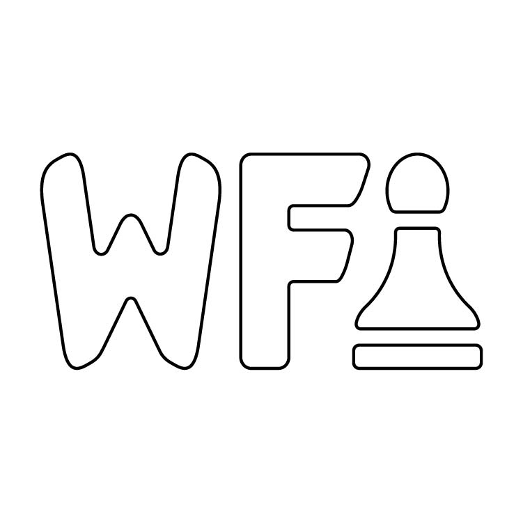
    &nbsp;
    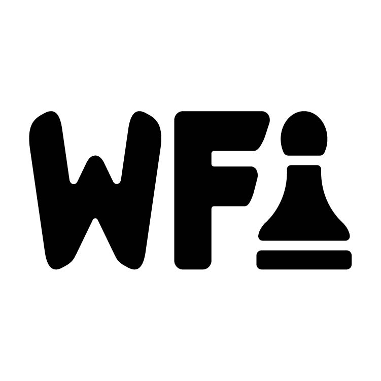
    &nbsp;
    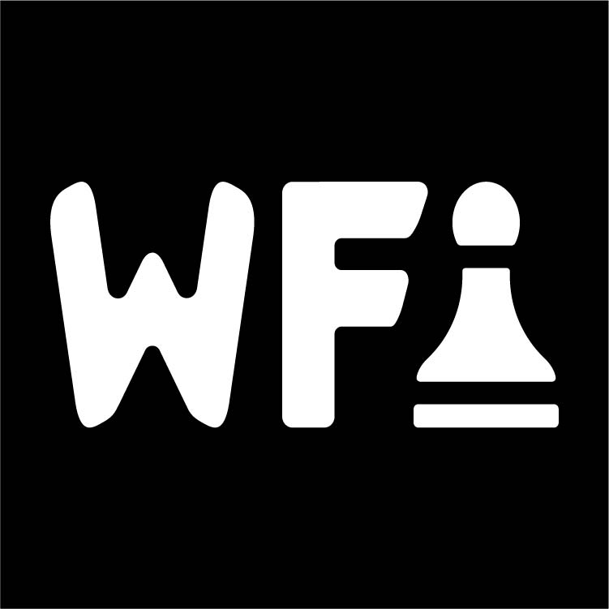
    &nbsp;
    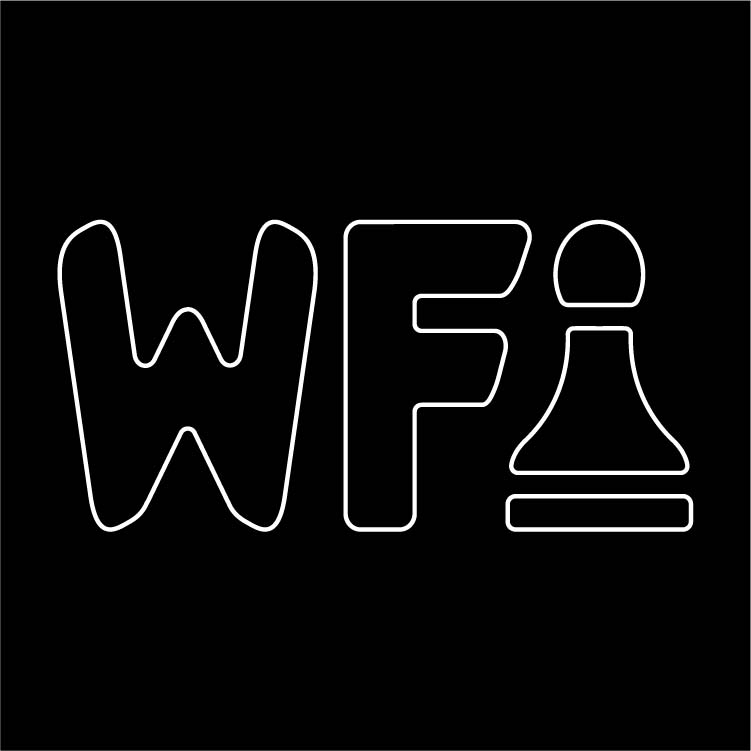

<h3 style="font-size: 16px">Concept #2: Company initials in block letters with a game piece in place of the letter "I"</h3>

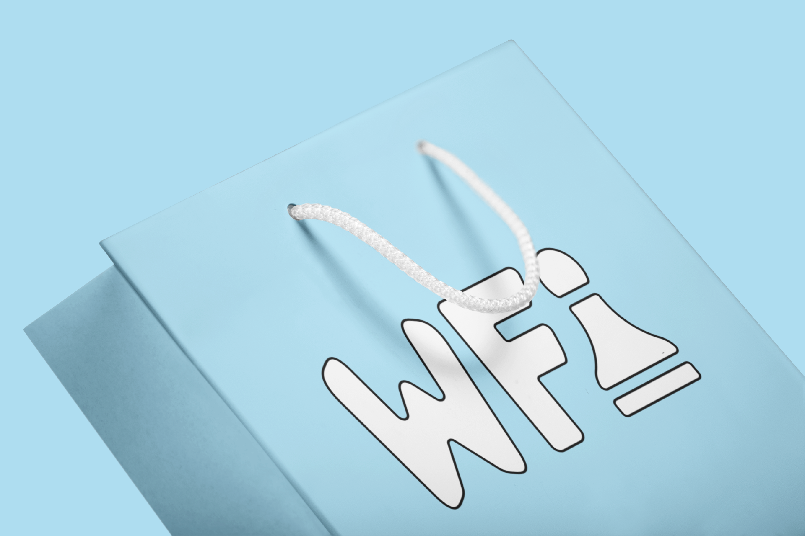

 

 

